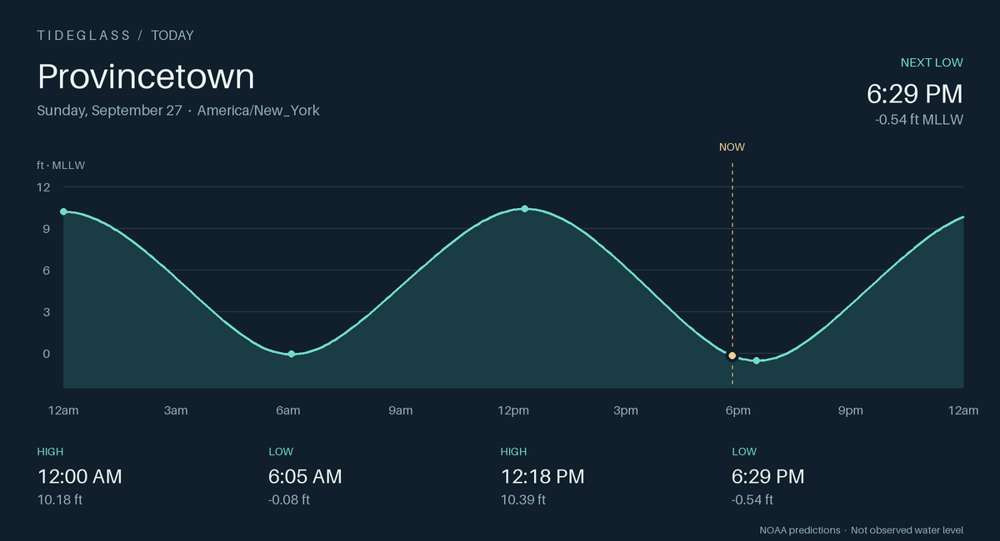

# Tideglass

**A little closer to the tide.** NOAA tide predictions, useful Home Assistant entities, and a calm coastal dashboard.



Defaults to **Provincetown, Massachusetts — NOAA station 8446121**. No API key or subscription. Supports other NOAA tide prediction stations; NOAA coverage is not worldwide.

## What you get

One device per station, with 20 entities:

| Entities | Use |
|---|---|
| Most recent tide, time and height | The latest predicted high/low at or before now |
| Next tide and next tide time | The next predicted turning point after now |
| Next low time / height, next high time / height | Native timestamp sensors and numeric heights |
| Tide direction; tide rising binary sensor | Rising/falling based on the next turning point |
| Predicted height | NOAA six-minute curve, interpolated to now; never presented as an observation |
| Week | Count and structured `tides` attribute for today plus six local calendar days |
| Tides calendar | High/low events, native calendar triggers and arbitrary requested date windows up to one year |
| Today dark / light; Week dark / light | Four locally rendered PNG image entities with a moving now line |
| Prediction status; Last NOAA update | Fresh/cached status and the last successful fetch |

Times are stored as timezone-aware UTC timestamps and displayed in Home Assistant’s local time. Graph day boundaries and labels use the configured station time zone, including 23/25-hour daylight-saving days. Heights are relative to **MLLW**, with feet or meters selectable in options. HA’s per-entity unit overrides still apply to numeric sensors.

High/low sensors use NOAA’s actual high/low prediction product. Harmonic stations use NOAA’s six-minute curve. Subordinate stations get an explicitly labeled illustrative curve between the official extrema; their current-height sensor is unavailable because a high/low table does not provide a continuous prediction.

## A dashboard for the coast

[`examples/weather-dashboard-aesthetic.yaml`](examples/weather-dashboard-aesthetic.yaml) is the styled Coast dashboard: Tideglass’s navy, seafoam and gold palette, a large current-weather panel, a six-hour outlook, full-width tide curves, explicit high/low times and heights, radar, wind, and a readable seven-day tide table. It uses the HACS **button-card** and **clock-weather-card** frontend cards. Colors stay scoped to the dashboard; no global theme change is needed. See the [styled dashboard guide](docs/DASHBOARD.md).

[`examples/weather-dashboard.yaml`](examples/weather-dashboard.yaml) combines the existing NWS Provincetown weather entity (`weather.kpvc`), supported day/night and hourly forecasts, today’s tide curve, upcoming tide tiles, a Windy radar map, a separate Windy wind map, and a seven-day curve/calendar. Native HA cards only; no frontend custom-card dependency.

[`examples/coast-theme.yaml`](examples/coast-theme.yaml) adds matching light/dark colors and soft card corners. See the [installation and validation instructions](docs/INSTALLATION.md).

## Automation and data examples

Use the timestamp sensors in native time triggers, numeric heights in numeric-state triggers, and the calendar for reminders before a tide. [`examples/automations.yaml`](examples/automations.yaml) includes a low-tide reminder 30 minutes beforehand and a height threshold. Examples are not enabled automatically. Calendar reminders use HA’s scheduling; events missed while HA is stopped are not replayed.

Structured week data:

```jinja
{{ state_attr('sensor.provincetown_tideglass_week', 'tides') }}
```

```json
[{"time":"2026-09-27T22:29:00+00:00","height":-0.539,"type":"low"}]
```

The week sensor exposes `time_zone`, `height_unit`, `datum`, and fetched event bounds as attributes. `calendar.get_events` provides standard consumable event data, including times, heights in summaries, and station information. Missing measurements remain unavailable rather than becoming zero.

## Network and failure behavior

Predictions refresh every six hours and at the next minute tick after station-local midnight. The graph, tide direction and “next” sensors update locally every minute; viewing images does not call NOAA. Graphs render on demand in HA’s executor and are cached for the minute. This is a tide clock, not a second-accurate event feed.

A saved prediction cache survives HA restarts. After a failed refresh, still-covered predictions remain usable for at most 48 hours from the last successful fetch, with status `cached` and retries every 15 minutes. Once expired or outside the current tide cycle, entities become unavailable. The future tide table is bounded to seven local calendar days, avoiding huge recorder attributes. No API credentials are stored.

Tide predictions do not account for storm surge or actual water-level observations. The maps and NWS weather integration have their own data availability and update behavior.

## Development status

Version `0.1.0` is an initial release for use as a **HACS custom repository**, installed and verified on Home Assistant 2026.9.3. Add `https://github.com/andrewyoung918/ha-tideglass` to HACS as an Integration. This project is not listed in HACS’s default catalog. See [verification notes](docs/VERIFICATION.md) for the live checks and remaining limits.

Source: `/Users/andrew/Development/ha-tideglass`. Andrew’s live-configuration workflow remains in `/Users/andrew/Development/home-assistant-config`; this is an integration project, not a second house-configuration tree.

```sh
python3.14 -m venv .venv
.venv/bin/pip install -r requirements-dev.txt
.venv/bin/ruff check .
.venv/bin/pytest -q
```

Tests exercise real Home Assistant 2026.9.3 setup, all platforms, image serving, config flows, cache/restart/offline behavior, time rollover, DST, UTC API requests, and curve generation using captured public NOAA fixtures. They do not replace the live UI configuration check, restart, and dashboard verification.

## Sources

- [NOAA CO-OPS API](https://api.tidesandcurrents.noaa.gov/api/prod/) and [Provincetown station](https://tidesandcurrents.noaa.gov/stationhome.html?id=8446121)
- [Home Assistant image entities](https://developers.home-assistant.io/docs/core/entity/image/) and [calendar entities](https://developers.home-assistant.io/docs/core/entity/calendar/)
- [HACS integration requirements](https://www.hacs.xyz/docs/publish/integration/)
- [Windy’s official map embed](https://embed.windy.com/config/map)

MIT licensed. Not affiliated with NOAA, Windy, or Home Assistant.
